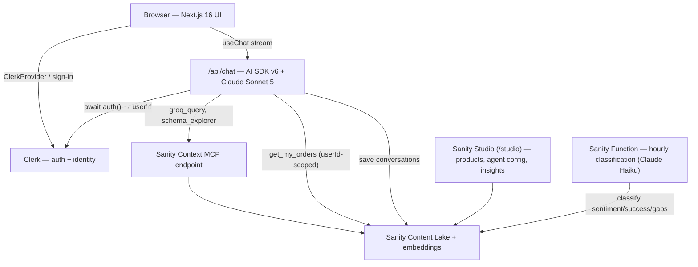
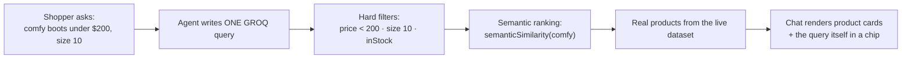
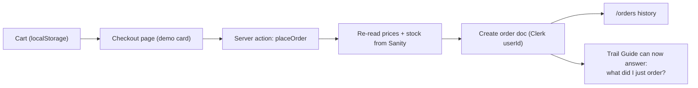

# Trailhead — AI-Powered Storefront with Sanity Context, Clerk & Next.js 16

[](https://nextjs.org/)
[](https://sanity.io/get-started?coupon=sonny)
[](https://go.clerk.com/sonny)
[](https://sdk.vercel.ai/)
[](https://www.anthropic.com/)
[](https://tailwindcss.com/)
[](https://www.typescriptlang.org/)

> **Disclaimer:** Trailhead is a fictional educational project. The brands,
> products, prices, reviews, and orders in the demo data are synthetic. Sanity,
> Clerk, Anthropic, Vercel, Next.js, React, Tailwind CSS, and other third-party
> names are trademarks of their respective owners and are used only to identify
> the technologies demonstrated here.

Trailhead is a complete outdoor-gear storefront with an AI shopping assistant
— the **Trail Guide** — that genuinely knows every product in the store.

Ask it _"Comfy hiking boots under $200, size 10?"_ and it writes **one GROQ
query** against your live Sanity dataset: hard filters for price, size, and
stock, combined with **semantic ranking** for "comfy". Real products. Filtered
by your rules. Ranked by relevance. Signed in with
[Clerk](https://go.clerk.com/sonny)? It can answer _"What did I order last
time?"_ too.

> **Who is this for?**
> Developers learning how to connect an AI agent to real structured content —
> without building a RAG pipeline, a vector database, or a sync job. If you
> have ever wanted a chatbot that answers from **your** data instead of
> hallucinating, this is the pattern.

> **What makes it different?**
> The agent is not fed a text dump. [Sanity Context](https://www.sanity.io/context)
> gives it your **schema** and teaches it **GROQ** through one MCP endpoint, so
> it reasons over your content model: exact filters where you need precision,
> semantic search where you need vibes, references where you need structure —
> all in a single query. Editors tune the agent from Sanity Studio with zero
> deploys.

> **Under the hood**
> Next.js 16 App Router + React 19 · Sanity v6 (embedded Studio, Content Lake,
> dataset embeddings, Functions) · Sanity Context MCP · Clerk v7 (Core 3) ·
> Vercel AI SDK v6 + `@ai-sdk/mcp` · Claude Sonnet 5 · Tailwind CSS v4 ·
> TypeScript strict

---

## 👇🏼 DO THIS Before You Get Started

1️⃣ Sign up to Clerk 👉 **[https://go.clerk.com/sonny](https://go.clerk.com/sonny)**

2️⃣ Sign up to Sanity 👉 **[https://sanity.io/get-started?coupon=sonny](https://sanity.io/get-started?coupon=sonny)**

3️⃣ Join my new AI Community for FREE! 👉 **[https://www.papareact.com/ztoh-form](https://www.papareact.com/ztoh-form)**

| Service | What it does in this build | Sign up |
| --- | --- | --- |
| **Clerk** | Authentication, sign-in modal, user profile, and the identity that personalizes the AI agent | **[Create a free Clerk account →](https://go.clerk.com/sonny)** |
| **Sanity** | Product catalog, orders, agent configuration, conversation insights — and the Sanity Context MCP endpoint the agent queries | **[Create a free Sanity account →](https://sanity.io/get-started?coupon=sonny)** |
| **Anthropic** | Claude Sonnet 5 powers the Trail Guide chat | [Get an API key →](https://console.anthropic.com/) |

> 💡 Clerk ships with **keyless mode** — the app boots and sign-in works before
> you even create a Clerk application. You can claim the auto-provisioned
> instance later from the in-app prompt.

---

## 🤔 What Is This App?

Think of Trailhead as three products fused together: a content-driven
storefront, a CMS your whole team can use, and an AI shopping assistant that
reads from the same live dataset as the website.

**As a shopper, you can:**

- Browse 18 seeded outdoor products across 6 categories, live from Sanity
- Filter the catalog by category, size, price, and sort — via URL params
- Sign in with Clerk (modal, social logins, the works)
- Add gear to your pack (cart), check out with a **simulated payment**, and
  see your order history
- Chat with the **Trail Guide**: ask for gear by vibe, budget, and size; get
  clickable product cards; watch it apply catalog filters for you; ask about
  your own orders

**As a content editor, you can:**

- Manage products, categories, brands, and orders in Sanity Studio (embedded
  at `/studio`)
- Edit the agent's **system prompt** as a Sanity document — change its tone
  with zero deploys
- Edit the **Sanity Context document**: what content the agent can see
  (`groqFilter`) and dataset-specific guidance (`instructions`)
- Review every AI conversation, with AI-scored **sentiment, success, and
  content gaps** in the Insights dashboard

**As a developer, you get:**

- A complete Sanity Context integration: MCP client, initial-context caching,
  semantic search, custom + client-side tools, telemetry, and scheduled
  classification
- Clerk v7 (Core 3) with the Next.js 16 `proxy.ts` convention and the new
  `<Show>` control component
- Server-side order creation that never trusts client prices
- A seed script with data engineered to demo every feature

**Popular use cases for this pattern:**

- 🛍️ **E-commerce assistant** — this build
- 📚 **Docs helper** — same wiring, `article` schema instead of `product`
- 🎧 **Support agent** — FAQs + help articles with semantic matching
- 🗞️ **Content concierge** — "find me something to read about X"

---

## ✨ Features

### Storefront

- 🏔️ **Content-driven catalog** — every product, category, and brand lives in
  Sanity; edit a price in Studio and refresh
- 🔎 **URL-driven filters** — category pills, size, max price, sort; shareable
  and agent-drivable
- 🛒 **Cart drawer** — localStorage-persisted, hydration-safe
- 💳 **Dummy checkout** — demo card UI, totals recomputed server-side from
  Sanity prices (clients can never set their own prices)
- 📦 **Orders in Sanity** — each checkout writes an `order` document keyed by
  the Clerk user ID
- 🎨 **Trail-signage design system** — Barlow Condensed display type, topo-line
  motif, trail-blaze orange accents, Tailwind v4 tokens

### The Trail Guide (AI agent)

- 🧠 **Schema-aware from message one** — the Sanity Context `/initial-context`
  is injected into the system prompt (faster first response, better caching)
- 🔍 **One-query answers** — hard filters + `text::semanticSimilarity()`
  ranking in a single GROQ query
- 🃏 **Rich product cards in chat** — the model outputs
  `::document{id type}` directives; the UI renders live cards
- 🧾 **Transparent tool calls** — every GROQ query the agent writes is
  visible in an expandable chip
- 🎛️ **Agent drives the UI** — a client-side `set_product_filters` tool
  navigates the catalog for the shopper
- 👤 **Clerk-personalized** — a server-side `get_my_orders` tool is scoped to
  the signed-in user's ID; the agent physically cannot see anyone else's orders
- ✍️ **Editable behavior** — system prompt and context instructions are Sanity
  documents

### Insights & analytics

- 💾 **Every conversation saved** to Sanity automatically
  (`sanityInsightsIntegration`)
- 🤖 **AI classification on a schedule** — a Sanity Function scores success,
  **sentiment**, and content gaps hourly with Claude Haiku
- 📊 **Insights dashboard in Studio** — see what shoppers ask, where the agent
  struggles, and what content is missing

---

## 🧠 Sanity Context, Explained for Beginners

This is the heart of the build. If you learn one thing from this repo, make it
this section.

### The problem it solves

Normally, connecting an AI to your data means: export your content → chunk it
→ embed it into a vector database → keep that database in sync forever → and
even then the AI can only do fuzzy text matching. Ask it "boots under $200 in
size 10" and a vector search has no idea what `< 200` means — price is math,
not vibes.

**Sanity Context flips this.** Instead of copying your data out to the AI, it
gives the AI structured access **in** — one endpoint that teaches any agent
your schema and lets it write real queries against your live dataset.

### Part 1 — The MCP endpoint

MCP (Model Context Protocol) is a standard way to hand an AI a set of tools.
Sanity Context exposes one MCP endpoint per dataset:

```
https://api.sanity.io/v2026-03-03/context/mcp/<projectId>/<dataset>/<slug>
```

Any MCP-compatible agent (our Next.js route, Claude Desktop, anything) connects
with a read token and instantly gets four tools:

| Tool | What the agent uses it for |
| --- | --- |
| `initial_context` | A compressed overview of your schema: types, fields, document counts |
| `groq_query` | Run real GROQ queries against the live dataset — the workhorse |
| `schema_explorer` | Zoom into one document type's exact fields |
| `array_field_reader` | Read long array/rich-text fields that queries truncate |

In this repo the connection is ~10 lines in
[`src/app/api/chat/route.ts`](src/app/api/chat/route.ts):

```ts
const mcpClient = await createMCPClient({
  transport: {
    type: "http",
    url: process.env.SANITY_CONTEXT_MCP_URL,
    headers: { Authorization: `Bearer ${process.env.SANITY_API_READ_TOKEN}` },
  },
});
const tools = await mcpClient.tools(); // hand these straight to the model
```

### Part 2 — GROQ: exact filters AND semantic search in one query

GROQ is Sanity's query language. The magic of Sanity Context is that the agent
*writes GROQ for you* — and can mix precise filters with meaning-based ranking:

```groq
*[_type == "product" && price < 200 && "10" in sizes && inStock]
  | score(text::semanticSimilarity("comfy hiking boots"))
  | order(_score desc)
  { _id, title, price }[0...5]
```

Read it like a pipeline:

1. `*[...]` — **hard filters prune first.** Price is math. Size is exact.
   Stock is a boolean. No fuzzy matching here.
2. `score(text::semanticSimilarity("comfy…"))` — the survivors are **ranked by
   meaning**. "Comfy" matches "plush cushioned midsole, zero break-in" even
   though the word "comfy" appears nowhere in the document.
3. `order(_score desc)` — best match first.

One request. No separate vector DB. The seeded data proves the point: the
out-of-stock Granite Peak Pro and the $249 Summit Ridge GTX never make it past
step 1, and the stiff leather boot ranks last in step 2.

### Part 3 — Embeddings (what powers "comfy")

Semantic search needs **embeddings** — numeric fingerprints of meaning. Enable
them once per dataset:

```bash
npx sanity datasets embeddings enable production --wait
```

From then on it's automatic: **publish a product and Content Lake re-embeds it
in the background.** No webhooks, no re-index jobs, no sync code. Edit the
Ridgeline's description from "plush" to "stiff", hit Publish, and it drops down
the "comfy" ranking within moments. (Queries run against **published**
documents, so drafts never leak into agent answers.)

Two flags make it reachable: embeddings enabled on the dataset (above) and
`?embeddings=true` on the MCP URL. Note: embeddings have storage/compute costs
and there's no dashboard toggle — it's CLI/API only.

### Part 4 — The Sanity Context document (editors control the agent)

The `<slug>` at the end of the MCP URL points to a **Sanity Context document**
(`sanity.agentContext`) — created in Studio, seeded for you here under
**AI Agent → Sanity Contexts**. It has three fields:

| Field | What it does | Ours |
| --- | --- | --- |
| **Slug** | Becomes the `:slug` in the MCP URL | `storefront` |
| **Content Filter** (`groqFilter`) | A GROQ expression scoping what the agent can *ever* see | `_type in ["product", "category", "brand"]` |
| **Instructions** | Dataset-specific guidance injected into the agent's tools | sizes are strings, filter `inStock == true`, how to combine filters + ranking… |

Two big ideas here:

- **The filter is a hard security boundary.** Sanity Context wraps *every*
  query the agent writes with your `groqFilter` — you can see it in the query
  metadata. Notice `order` is **not** in our filter: the agent cannot query
  other people's orders even if prompted to. (Your own orders come through a
  separate Clerk-scoped tool — Part 6.)
- **Instructions close the domain gap.** The schema says `sizes` is an array
  of strings; it can't say _"footwear sizes look like `"10.5"` and you filter
  with `"10" in sizes`"_. That's what Instructions are for — and editors can
  refine them in Studio, live, with no deploy. (During this build we fixed a
  real wording bug — the agent saying "out of stock" for items we simply don't
  carry — by editing a prompt document, not code.)

You can also override per-request with URL params (`?instructions=…`,
`?groqFilter=…`) for testing, and the base URL (no slug) works with no document
at all.

### Part 5 — Initial context (make the first message fast)

Without help, an agent burns its first tool call asking "what content do you
have?". Sanity Context exposes the schema overview over plain HTTP too:

```
<your MCP URL>/initial-context
```

This build fetches it server-side, caches it for 5 minutes, and injects it into
the system prompt — then removes the now-redundant `initial_context` tool from
the model's toolset. First answers get faster and the stable schema prefix
makes prompt caching effective.

### Part 6 — Personalization (where Clerk comes in)

Sanity Context handles *catalog* knowledge. *Personal* knowledge needs
identity:

1. Clerk's middleware protects `/api/chat` — the agent only works signed in
2. The route reads `const { userId } = await auth()` — verified server-side,
   never supplied by the model
3. A custom `get_my_orders` tool queries orders **by that userId**

So "what did I order last time?" works, and prompt-injection can't cross user
boundaries: the model never chooses whose orders to read.

### Part 7 — Client-side tools (the agent touches the UI)

Two tools in [`src/lib/client-tools.ts`](src/lib/client-tools.ts) are defined
**without** an `execute` function — so the model can call them, but they run in
the shopper's browser via `useChat`'s `onToolCall`:

- `get_page_context` — reads the current page so "is *this one* waterproof?"
  works
- `set_product_filters` — the agent navigates the catalog for you ("show me
  rain gear" → `/products?category=jackets&q=rain`)

The agent is told to verify values with `groq_query` first, so it never applies
a filter that returns nothing.

### Part 8 — Conversation Insights (know if any of this works)

Two pieces, both included:

1. **Telemetry** — one integration on the `streamText` call saves every
   conversation to Sanity (view them in **AI Agent → Conversations**)
2. **Classification** — a scheduled Sanity Function
   ([`functions/classify-conversations`](functions/classify-conversations/index.ts))
   has Claude Haiku score each conversation: did the shopper succeed? what was
   the **sentiment**? what content was missing? Results feed the **Insights
   dashboard** in Studio.

Raw transcripts are data; classification turns them into decisions ("shoppers
keep asking for crampons — we don't stock crampons").

### Part 9 — Tuning (the loop that makes it good)

The repo ships with two more installed skills for your coding agent:
`dial-your-context` (iterate on the Instructions field against your real data)
and `shape-your-agent` (craft the system prompt). The workflow: watch Insights
→ spot a failure → tune Instructions or prompt in Studio → re-test. No deploys
anywhere in that loop.

---

## 🔄 How It Works

### Architecture



### One question, one query



### Checkout flow (simulated payment)



---

## 🏁 Getting Started

### Prerequisites

- Node.js **20.9+** (built on Node 24)
- npm (repo ships a `package-lock.json`) — pnpm needed only for
  function deploys (see step 8)
- A **[Clerk account](https://go.clerk.com/sonny)** and a
  **[Sanity account](https://sanity.io/get-started?coupon=sonny)**
- An [Anthropic API key](https://console.anthropic.com/)

### 1. Clone and install

```bash
git clone <this-repo>
cd sanity-context-clerk-ai-storefront
npm install
cp .env.example .env.local
```

You can `npm run dev` right now: the storefront boots with a setup banner and
Clerk keyless sign-in before any credentials exist.

### 2. Create the Sanity project

```bash
npx sanity login
npx sanity init --bare -y --create-project "Trailhead" --dataset production --organization <your-org-id>
```

(Find your org ID with `npx sanity organizations list`.) Put the printed
project ID in `.env.local` as `NEXT_PUBLIC_SANITY_PROJECT_ID`.

### 3. Create the two API tokens

```bash
# Read token (Viewer) — the agent's MCP connection + all storefront reads
npx sanity tokens add "Sanity Context" --role=viewer --project-id <id> --yes --json

# Write token (Editor) — orders + saving conversations
npx sanity tokens add "Trailhead Writer" --role=editor --project-id <id> --yes --json
```

Copy the `key` values into `SANITY_API_READ_TOKEN` and
`SANITY_API_WRITE_TOKEN`.

> ⚠️ New Sanity projects require a token for API reads **even on public
> datasets** — that's why every storefront query runs through the server-only
> client in [`src/sanity/lib/server-client.ts`](src/sanity/lib/server-client.ts)
> and no token ever reaches the browser.

### 4. Seed the store

```bash
npm run seed
```

Creates 6 categories, 4 brands, 18 products with photos, the Trail Guide
`agent.config`, and the `sanity.agentContext` document — all idempotent
(re-run it any time).

### 5. Deploy the schema + Studio

Sanity Context needs your schema in Sanity's schema store, served by a
deployed Studio:

```bash
npm run schema:deploy
npx sanity deploy        # pick a studio hostname when prompted
```

The embedded Studio at `/studio` keeps working locally — add a CORS origin for
your dev URL if prompted: `npx sanity cors add http://localhost:3000 --credentials`.

### 6. Enable embeddings (semantic search)

```bash
npx sanity datasets embeddings enable production --wait
```

### 7. Point the agent at the MCP endpoint

In `.env.local`:

```bash
SANITY_CONTEXT_MCP_URL=https://api.sanity.io/v2026-03-03/context/mcp/<PROJECT_ID>/production/storefront?embeddings=true
```

The `storefront` slug applies the seeded Sanity Context document.

### 8. Set up Clerk

Keyless mode already works, but for a real instance the
[Clerk CLI](https://go.clerk.com/sonny) does everything:

```bash
clerk auth login
clerk apps create "Trailhead" --json
clerk link --app <application_id>
clerk env pull            # writes both keys into .env.local
```

### 9. Add your Anthropic key

```bash
ANTHROPIC_API_KEY=sk-ant-...
# optional: ANTHROPIC_MODEL=claude-sonnet-5 (the default)
```

### 10. Run it

```bash
npm run dev
```

Open [http://localhost:3000](http://localhost:3000), sign in, and ask the
Trail Guide for comfy boots.

### 11. (Optional) Deploy conversation classification

This turns raw transcripts into sentiment/success/content-gap insights:

```bash
npx sanity blueprints init . --blueprint-type ts --project-id <id> --stack-name trailhead
npx sanity blueprints promote --project-id <id> --stack trailhead
npx sanity blueprints deploy --fn-installer pnpm
```

Test it immediately (no waiting for the hourly cron):

```bash
npm run functions:test
```

> The function has its **own** `package.json` and deploys with
> `--fn-installer pnpm` — see Common Issues for why.

### First-Time Setup Checklist

- [ ] **[Clerk account](https://go.clerk.com/sonny)** and
      **[Sanity account](https://sanity.io/get-started?coupon=sonny)** created
- [ ] Sanity project created, ID + both tokens in `.env.local`
- [ ] `npm run seed` completed (18 products visible in Studio)
- [ ] `npm run schema:deploy` + `npx sanity deploy` done
- [ ] Embeddings enabled and `ready`
- [ ] `SANITY_CONTEXT_MCP_URL` set with `?embeddings=true`
- [ ] Clerk keys pulled (or keyless claimed)
- [ ] `ANTHROPIC_API_KEY` set
- [ ] Signed in, placed a demo order, chat answers with product cards

---

## 🎭 The Demo Script

The seed data is engineered so every beat lands:

1. **Browse** `/products` — everything is live from Sanity. Change a price in
   `/studio`, refresh, it's changed.
2. **Sign in** with Clerk, add the Ridgeline Mid (size 10) to your pack, check
   out with the demo card → the order appears in `/orders` *and* in Studio.
3. **Ask the Trail Guide**: _"Comfy hiking boots under $200, size 10?"_ —
   expand the **"Queried Sanity with GROQ"** chip. One query: price + size +
   stock filters, semantic ranking for comfy. The **Granite Peak Pro**
   (out of stock) and **Summit Ridge GTX** ($249) are engineered traps — watch
   the agent skip both. The stiff Creekside leather boot ranks last.
4. **Ask**: _"What did I just order?"_ — the Clerk-scoped tool answers with
   your real order.
5. **Say**: _"Show me rain gear"_ — the agent drives the catalog filters
   itself.
6. **Live-tune in Studio**: edit the Ridgeline description from "plush" to
   "stiff, long break-in", publish, re-ask question 3 — the ranking changes.
   Then edit the agent's Instructions or system prompt and watch its behavior
   change. **No deploys anywhere.**
7. **Check Insights** in Studio: your conversations, scored for sentiment and
   success.

---

## 🐛 Common Issues and Solutions

Every one of these was hit for real while building this:

| Problem | Solution |
| --- | --- |
| Storefront shows 0 products but Studio has data | New Sanity projects return **empty results for tokenless API reads** even on public datasets. All reads must go through the server client (Viewer token). Never fetch from the browser. |
| MCP endpoint returns *"Only datasets with deployed Studio applications are supported"* | Run `npx sanity deploy` (or `sanity deploy --external --schema-required` for self-hosted). A deployed **schema** alone is not enough. |
| GROQ error *"Embeddings are not enabled for this dataset"* | `npx sanity datasets embeddings enable production --wait` — and keep `?embeddings=true` on the MCP URL. There is **no dashboard toggle**; CLI/API only. |
| Embedded `/studio` shows "Connect this Studio to your project / Add CORS origin" | `npx sanity cors add http://localhost:3000 --credentials` (match your exact dev origin). |
| Blueprint deploy fails: *"Native modules detected: @rolldown/binding… lightningcss…"* | The function bundler is packaging your Next.js app's dependency tree. Give the function its own `package.json` (already done here) **and** deploy with `--fn-installer pnpm` — npm auto-installs `@sanity/context`'s `sanity` peer dependency, which drags in the Studio's native binaries; pnpm doesn't. |
| Blueprint deploy fails: *"would run minutely but your plan limits you to hourly"* | Sub-hourly cron schedules need a higher Sanity plan. This repo uses `0 * * * *` (hourly). |
| `blueprints init/promote` hangs in scripts | They're interactive. Use the flag forms shown in step 11. |
| Chat returns 401 | By design — `/api/chat` is Clerk-protected. Sign in first. |
| Agent says something is "out of stock" when we just don't sell it | Prompt wording, not data. The system prompt (a Sanity document!) now instructs: "out of stock" only when `inStock == false`; otherwise "we don't carry it". Edit it in **AI Agent → Agent Configs**. |
| Port 3000 already in use | `npm run dev` will pick another port — then add that origin with `npx sanity cors add`. |

---

## 🏆 Take It Further — Challenge Time

- 💳 **Real payments** — swap the dummy checkout for Stripe and set order
  `status` from webhooks
- 🖼️ **Visual search** — add the reference implementation's screenshot tool so
  the agent can *see* the page
- ⭐ **Reviews as content** — a `review` schema, semantically searchable
  ("what do people say about sizing?")
- 🌦️ **Live context tools** — a weather tool + "what should I pack for
  Snowdonia this weekend?"
- 🌍 **Localization** — localized fields + a `language ==` filter in the
  Sanity Context document
- 📉 **Close the loop** — auto-create draft products from Insights content
  gaps
- 🔁 **Real-time stock** — decrement stock on order, restock alerts via a
  scheduled Function

---

## 📋 Quick Reference

### Commands

| Command | What it does |
| --- | --- |
| `npm run dev` | Start the storefront + embedded Studio |
| `npm run seed` | Seed products, brands, categories, agent config, context doc (idempotent) |
| `npm run schema:deploy` | Push the schema to Sanity's schema store |
| `npm run deploy:blueprints` | Deploy the classification function (add `--fn-installer pnpm`) |
| `npm run functions:test` | Run conversation classification right now, locally |
| `npx tsx scripts/smoke-chat.ts` | Test the full agent pipeline (model + MCP) without the browser |
| `npx sanity datasets embeddings status production` | Check semantic-search indexing |
| `npm run typecheck` / `npm run lint` / `npm run build` | All green ✅ |

### Key Files

| Path | Purpose |
| --- | --- |
| `src/app/api/chat/route.ts` | The agent: MCP client, initial-context cache, tools, streaming, telemetry |
| `src/lib/client-tools.ts` | Browser-executed tool definitions (page context, filters) |
| `src/components/chat/` | Chat widget, GROQ-chip tool activity, directive product cards |
| `src/sanity/schemaTypes/` | Product, category, brand, order, agent-config schemas |
| `src/sanity/lib/server-client.ts` | Server-only read client (the only way data is fetched) |
| `src/app/(store)/checkout/actions.ts` | Server action: price-verified dummy checkout |
| `src/proxy.ts` | Clerk middleware (Next 16 convention) protecting chat/orders/checkout |
| `scripts/seed.ts` | Demo dataset with engineered demo traps |
| `sanity.blueprint.ts` + `functions/` | Scheduled conversation classification |
| `sanity.config.ts` | Embedded Studio + `contextPlugin()` + AI Agent structure group |

### Important Concepts

- **Schema-aware beats embedding-only** — filters are exact, semantics rank
  the survivors, one query does both
- **The `groqFilter` is a security boundary** — the agent can only ever see
  what the context document allows
- **Identity comes from Clerk, never the model** — personal tools are scoped
  server-side by `await auth()`
- **Prompts are content** — system prompt and instructions are Sanity
  documents; tuning is editing, not deploying
- **Embeddings maintain themselves** — publish → re-embed, automatically
- **Insights close the loop** — saved conversations + scheduled classification
  tell you what to fix next

---

## 📜 License, Security, and Notices

This repository is for educational and reference purposes. Trailhead is a
fictional store; all products, reviews, and orders are synthetic. Do not commit
`.env.local`, Sanity tokens, Clerk keys, or Anthropic keys. Payments are
simulated — no money moves.

Signup links in this README use the project owner's campaign URLs:
**[Clerk →](https://go.clerk.com/sonny)** ·
**[Sanity →](https://sanity.io/get-started?coupon=sonny)** ·
**[Join the AI Community →](https://www.papareact.com/ztoh-form)**

---

Built to show what happens when your AI agent stops guessing and starts
querying: real products, your rules, one endpoint. See you on the trail. 🏔️
